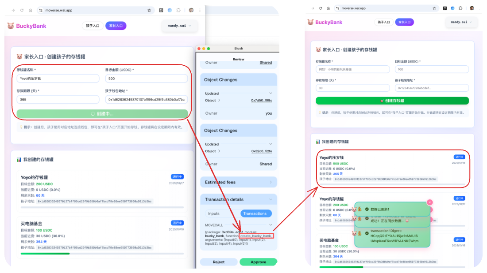
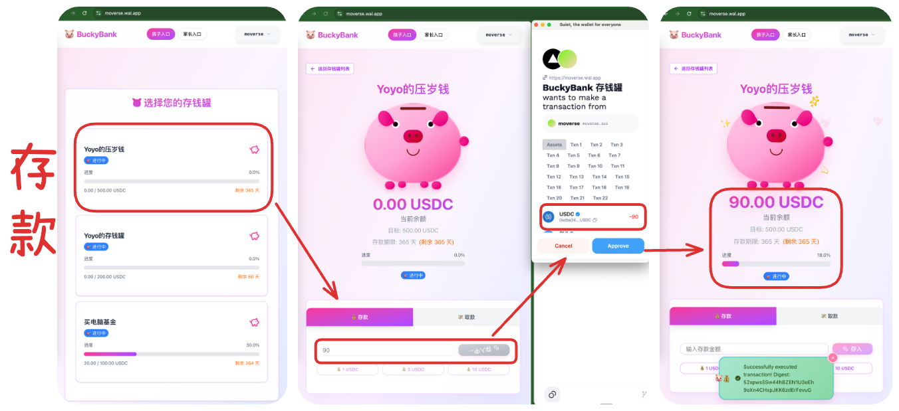
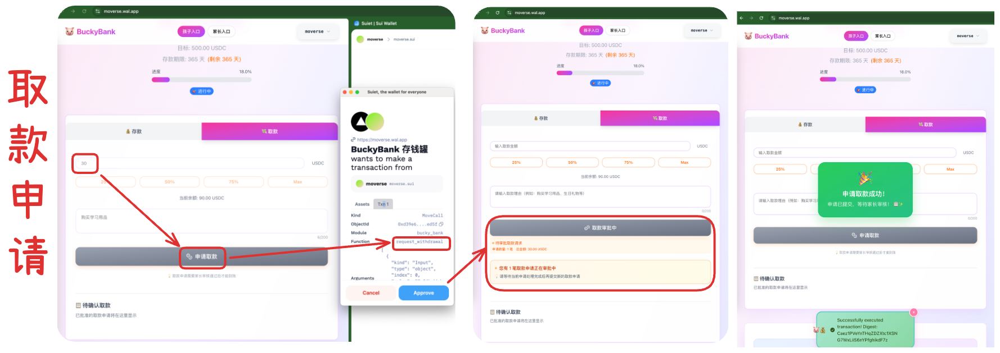
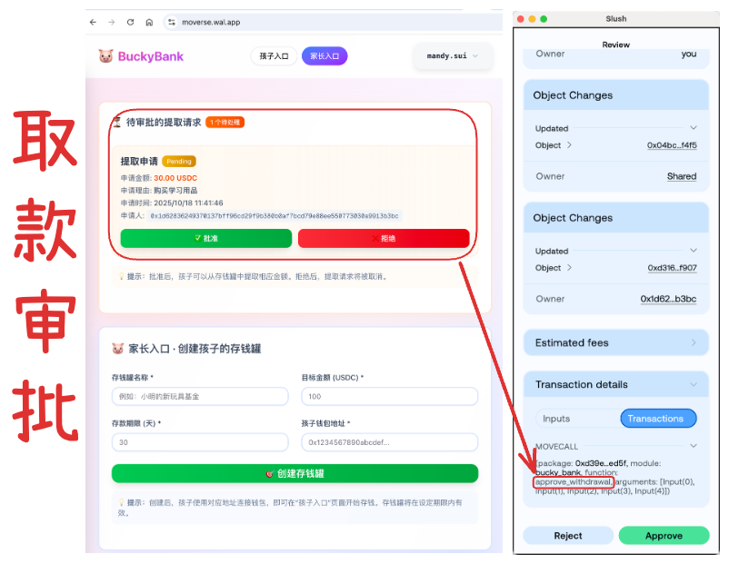
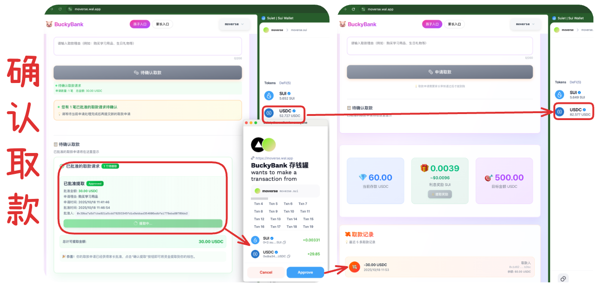
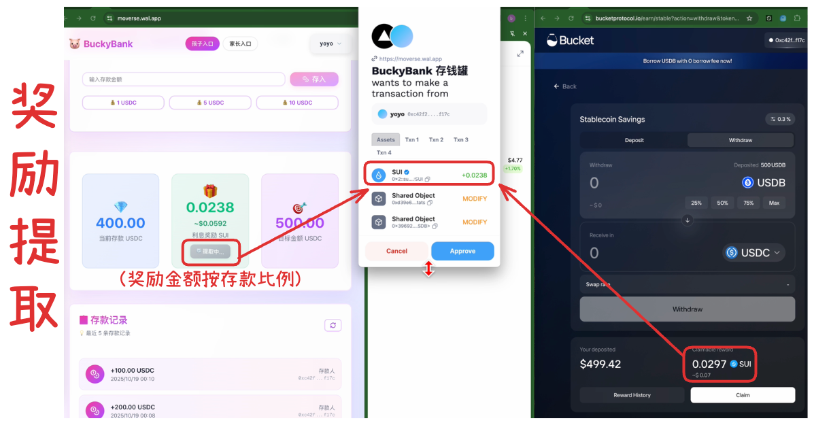

# Bucky Bank

> 儿童友好型链上理财存钱罐 (Based on `Sui` + `Bucket Protocol`)

## 项目简介

- `BuckyBank` 是一个基于 `Sui` + `Bucket Protocol` 去中心化 **存钱罐** 应用，旨在为家庭提供智能化的儿童理财教育解决方案。
- 该系统通过`Sui Move`智能合约实现家长管理的儿童存钱罐功能，并结合`Bucket Protocol`储蓄池收益体系，为儿童提供完整的链上储蓄体验。

## 核心价值

- **教育价值**：培养儿童良好的储蓄习惯和理财意识，循序渐进地建立财富观念
- **家庭价值**：创造亲子共同管理财务的场景，让理财成为家庭教育与互动的一部分
- **技术价值**：以儿童友好的方式，让下一代在真实资产交互中轻松接触`Web3`技术

## 产品体验

https://moverse.wal.app/

## 演示视频

https://drive.google.com/file/d/1t-dy4RtLpLwzeUtvANFeiPUnoEPdCwWS/view?usp=sharing

## 架构设计

## 使用界面

### （1）创建存钱罐

### （2）存款

### （3）取款申请

### （4）取款审批

### （5）确认取款

### （6）奖励提取

## 后续规划

- 理财教育内容
- 社交功能 (好友、排行榜)
- 家庭成员管理（敏感信息结合`Seal`）
- AI理财顾问
- NFT奖励系统
- 存钱罐模板系统

## 愿景

**BuckyBank成为家庭理财教育领域的重要工具，为更多家庭提供链上现代化智能化的财务管理解决方案。**
