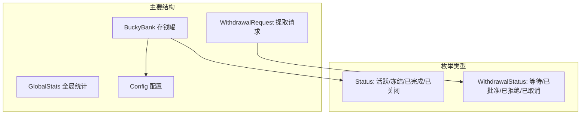
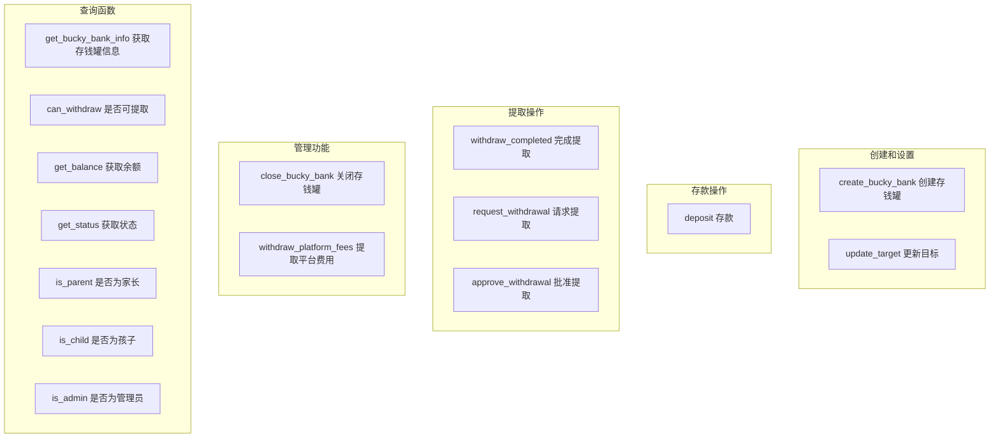
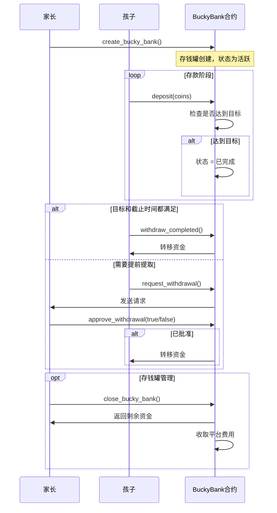

# Bucky Bank 智能合约

## 概述
Bucky Bank 是一个存钱罐合约，允许家长为孩子创建储蓄目标。孩子可以存入资金，家长可以管理提取和设置。

## 合约接口

### 核心数据结构

### 公共函数概览

## 详细接口文档

### 1. 存钱罐创建和配置

#### `create_bucky_bank`
为孩子创建一个新的存钱罐。

**参数：**
- `name: vector<u8>` - 存钱罐名称（最多100字符）
- `target_amount: u64` - 目标储蓄金额（SUI）
- `duration_days: u64` - 持续天数
- `child_address: address` - 孩子的钱包地址
- `is_withdrawable_before_deadline: bool` - 是否允许提前提取
- `clock: &Clock` - 系统时钟引用
- `ctx: &mut TxContext` - 交易上下文

**访问权限：** 任何人（通常是家长）

#### `update_target`
完成目标后更新目标金额和截止日期。

**参数：**
- `bucky_bank: &mut BuckyBank` - 存钱罐引用
- `new_target_amount: u64` - 新目标金额
- `new_duration_days: u64` - 新持续时间
- `clock: &Clock` - 系统时钟
- `ctx: &mut TxContext` - 交易上下文

**访问权限：** 仅孩子

### 2. 存款操作

#### `deposit`
允许孩子向存钱罐存入SUI。

**参数：**
- `bucky_bank: &mut BuckyBank` - 存钱罐引用
- `deposit_coin: Coin<SUI>` - 要存入的SUI代币
- `clock: &Clock` - 系统时钟
- `ctx: &mut TxContext` - 交易上下文

**访问权限：** 仅孩子

### 3. 提取操作

#### `withdraw_completed`
当达到目标且过了截止日期时直接提取。

**参数：**
- `bucky_bank: &mut BuckyBank` - 存钱罐引用
- `amount: u64` - 提取金额
- `clock: &Clock` - 系统时钟
- `ctx: &mut TxContext` - 交易上下文

**访问权限：** 仅孩子（满足条件时）

#### `request_withdrawal`
创建提取请求供家长审批。

**参数：**
- `bucky_bank: &BuckyBank` - 存钱罐引用
- `amount: u64` - 请求金额
- `reason: vector<u8>` - 提取原因（最多200字符）
- `clock: &Clock` - 系统时钟
- `ctx: &mut TxContext` - 交易上下文

**访问权限：** 仅孩子

#### `approve_withdrawal`
家长批准或拒绝提取请求。

**参数：**
- `request: WithdrawalRequest` - 提取请求
- `bucky_bank: &mut BuckyBank` - 存钱罐引用
- `approve: bool` - 是否批准请求
- `ctx: &mut TxContext` - 交易上下文

**访问权限：** 仅家长

### 4. 管理功能

#### `close_bucky_bank`
关闭存钱罐并分配剩余资金。

**参数：**
- `stats: &mut GlobalStats` - 全局统计
- `bucky_bank: BuckyBank` - 要关闭的存钱罐对象
- `ctx: &mut TxContext` - 交易上下文

**访问权限：** 仅家长

#### `withdraw_platform_fees`
允许管理员提取收集的平台费用。

**参数：**
- `stats: &mut GlobalStats` - 全局统计
- `amount: u64` - 提取金额
- `clock: &Clock` - 系统时钟
- `ctx: &mut TxContext` - 交易上下文

**访问权限：** 仅管理员

### 5. 查询函数

#### `get_bucky_bank_info`
返回存钱罐的详细信息。

**返回值：**
- `name: String` - 存钱罐名称
- `target_amount: u64` - 目标金额
- `current_balance: u64` - 当前余额
- `child_address: address` - 孩子地址
- `status: Status` - 当前状态
- `deposit_count: u64` - 存款次数
- `created_at_ms: u64` - 创建时间戳
- `last_deposit_ms: u64` - 最后存款时间戳
- `deadline_ms: u64` - 截止时间戳
- `is_withdrawable_before_deadline: bool` - 提前提取设置

#### 其他查询函数
- `can_withdraw(bucky_bank, clock): bool` - 检查是否允许提取
- `get_balance(bucky_bank): u64` - 获取当前余额
- `get_status(bucky_bank): Status` - 获取当前状态
- `is_parent(bucky_bank, addr): bool` - 检查地址是否为家长
- `is_child(bucky_bank, addr): bool` - 检查地址是否为孩子
- `is_admin(stats, addr): bool` - 检查地址是否为管理员

## 访问控制矩阵

| 函数 | 家长 | 孩子 | 管理员 | 任何人 |
|------|------|------|--------|--------|
| create_bucky_bank | ✓ | ✓ | ✓ | ✓ |
| deposit | ❌ | ✓ | ❌ | ❌ |
| withdraw_completed | ❌ | ✓* | ❌ | ❌ |
| request_withdrawal | ❌ | ✓ | ❌ | ❌ |
| approve_withdrawal | ✓ | ❌ | ❌ | ❌ |
| close_bucky_bank | ✓ | ❌ | ❌ | ❌ |
| update_target | ❌ | ✓* | ❌ | ❌ |
| withdraw_platform_fees | ❌ | ❌ | ✓ | ❌ |
| 查询函数 | ✓ | ✓ | ✓ | ✓ |

*需满足条件

## 事件

合约会发出以下事件：
- `BuckyBankCreated` - 创建新存钱罐时
- `DepositMade` - 进行存款时
- `WithdrawalRequested` - 请求提取时
- `WithdrawalApproved` - 提取被批准时
- `WithdrawalRejected` - 提取被拒绝时
- `BuckyBankClosed` - 存钱罐关闭时
- `PlatformFeesWithdrawn` - 平台费用被提取时

## 常量

- `PARENT_DEPOSIT`: 1 SUI (1,000,000,000 MIST)
- `PLATFORM_FEE`: 0.1 SUI (100,000,000 MIST)
- `MAX_NAME_LENGTH`: 100 字符
- `MAX_REASON_LENGTH`: 200 字符

## 使用流程

