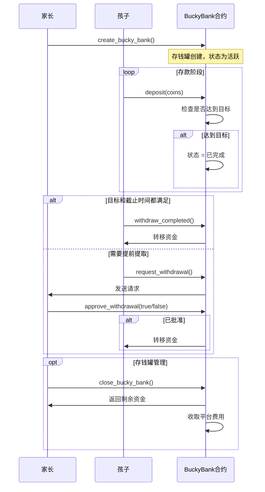
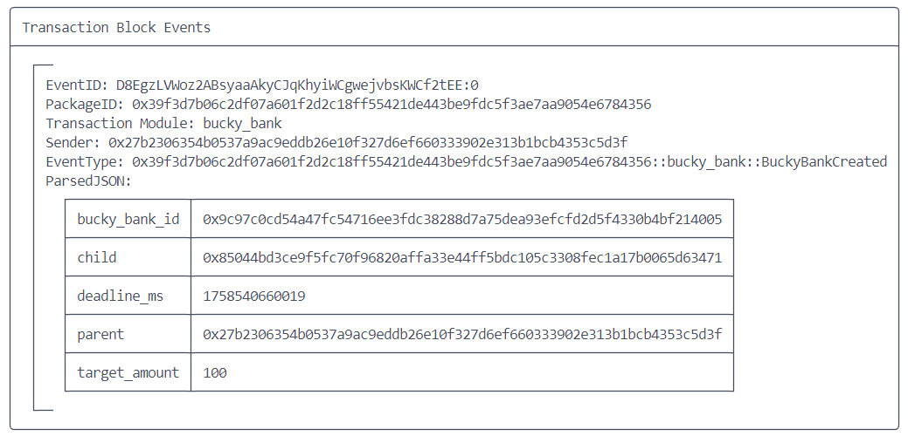
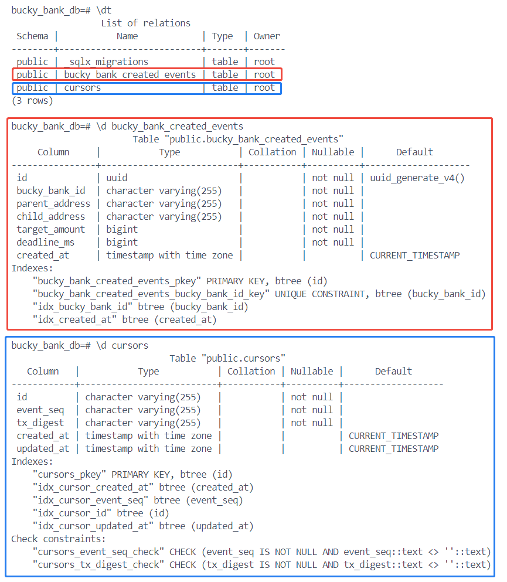
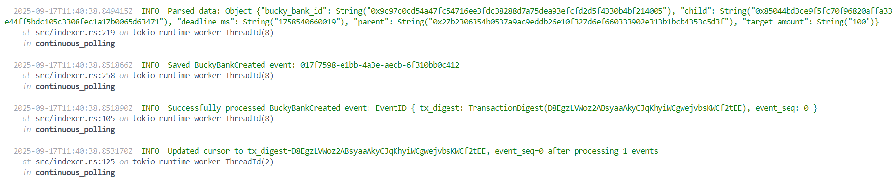
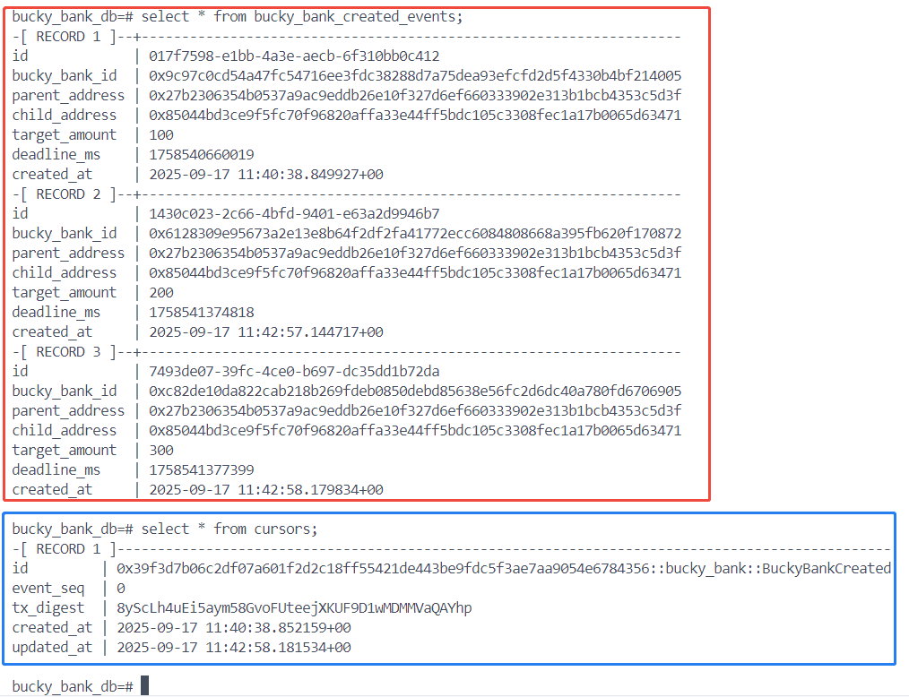

## 核心逻辑

> 暂未添加`bucket protocal`。



## 合约部署

```
$ sui client publish

export PACKAGE_ID=0x39f3d7b06c2df07a601f2d2c18ff55421de443be9fdc5f3ae7aa9054e6784356
export GLOBAL_STATS_ID=0x7843c4ba76cb7524ddae51ea5978fdecb3b0cd7681f70195528c78c3d240ffd9
```

## 创建存钱罐合约接口调用

```bash
export NAME=test
export DURATION_DAYS=5
export CHILD_ADDRESS=0x85044bd3ce9f5fc70f96820affa33e44ff5bdc105c3308fec1a17b0065d63471
export IS_WITHDRAWABLE_BEFORE_DEADLINE=true
export CLOCK=0x6
export TARGET_AMOUNT=300

sui client call --package $PACKAGE_ID --module bucky_bank --function create_bucky_bank --args $NAME $TARGET_AMOUNT $DURATION_DAYS $CHILD_ADDRESS $IS_WITHDRAWABLE_BEFORE_DEADLINE $CLOCK
```



## 创建数据库和表

```
sqlx database create
sqlx migrate run
```



## 启动indexer服务

```bash
$ ./target/release/bucky_bank_indexer --config=config.toml

  2025-09-17T11:40:38.733639Z  INFO  Loading configuration from config.toml
    at src/main.rs:56 on main ThreadId(1)

  2025-09-17T11:40:38.734271Z  INFO  Starting indexer and server mode
    at src/main.rs:73 on main ThreadId(1)

  2025-09-17T11:40:38.741955Z  INFO  Health check server listening on 127.0.0.1:8080
    at src/main.rs:163 on main ThreadId(1)
```

## 监听事件入库



## 数据库查看



